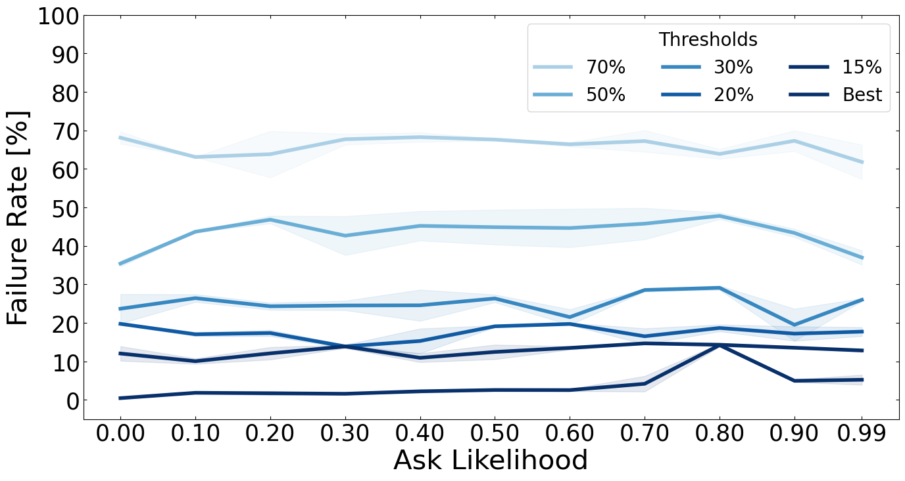

# Reinforcement Learning Framework

## Overview

This is a Reinforcement Learning framework that provides an environment for experimenting with RL algorithms. 
It includes components for defining environments, implementing algorithms, conducting experiments, visualizing results, and logging data.

## Components

### Environments

The `environments` module provides a collection of environments following the [OpenAI Gymnasium](https://gymnasium.farama.org/api/env/) interface.

- **Grid Worlds**
    - cliff walking

- **Robot Arms**
    - nao 4 DoF
    - kuka_lbr_iiwa 7 DoF

- **Classic Control**
    - continuous cartpole

### Algorithms

The `algorithms` module contains implementations of various RL algorithms. 

- **Algorithms for discrete state and action space:**
    - Q-Learning and Deep Q-Learning (DQN)
    - SARSA and Deep SARSA (DSN)
    - Proximal Policy Optimization (PPO)

- **Algorithms for continuous state and action space:**
    - Continuous Actor-Critic Learning Automaton (CACLA)
    - CACLA + Var
  
### Experiments

The `experiments` module provides tools for conducting experiments with RL algorithms. This includes scripts for running experiments with different configurations, hyperparameters, and environments. Experiment results are logged for analysis and comparison.

### Visualizers

The `visualizers` module offers visualization tools for analyzing RL agent behavior and performance. This includes plotting utilities for visualizing training curves, exploring agent policies, and monitoring convergence.

### Loggers

The `loggers` module handles logging of experiment data, including training statistics, evaluation metrics, and agent performance. 
You can customize your logger for different environment by inheriting class Logger from `logger.py`

## Getting Started

To get started with the framework, follow these steps:
1. Create virtual environment: `conda env create -f environment.yml`
2. Activate `rl-framework` environment: `conda activate rl-framework`
3. Write a configuration files (see: `config_template.json` ) for your experiment   
**Note: Logger configuration is optional, if not provided, the `BasicLogger` will be used.**
1. Write your experiment script and start your experiment. 

## Example Usage

### Run RL Experiment

```python
from agent import Agent
from experiment_runner import ExperimentRunner
from qlearning import QLearning
from cliff import Cliff
from logger_cliff import LoggerCliff

if __name __ == "__main__":
    config_file = "Q_learning_config.json"
    # Load configuration for algorithm, environment and logger
    runner = ExperimentRunner(config_file)
    # Build agent
    algorithm = QLearning(**runner.algorithm_paras)
    env = Cliff(**runner.environment_paras)
    logger = LoggerCliff(env, algorithm, **runner.logger_paras) # Optional
    agent = Agent(env, algorithm, logger, **runner.agent_paras) # or agent = Agent(env, algorithm, **runner.agent_paras)
    # Conduct experiment
    runner.run_experiment(agent)
```
### Hyperparameter Optimization with SMAC3
Here is a simple demonstration of how to use the Versatile Bayesian Optimization Package [SMAC3](https://github.com/automl/SMAC3) to execute a Hyperparameter Optimization experiment.

```python
from functools import partial

from ConfigSpace import ConfigurationSpace, Float

from hpoagent import HPOAgent
from qlearning import QLearning
from cliff import Cliff
from hpo_runner import HPORunner

if __name__ == "__main__":
    # Define the configuration space
    cs = ConfigurationSpace()
    cs.add_hyperparameter(Float("learning_rate", (0.01, 0.99)))
    cs.add_hyperparameter(Float("discount_factor", (0.1, 0.9)))
    cs.add_hyperparameter(Float("epsilon", (0.1, 0.99)))
    # Initialize environment
    env = Cliff(punishment=True)
    # Make a partial class with fixed hyperparameters that you do not want to optimize
    # Algorithm will be initialized inside the HPOAgent
    partial_algorithm = partial(
        QLearning,
        name="Q_LEARNING",
        qtable_shape=[4, 12],
        num_actions=4,
        init_method="zero",
        exploration="e-greedy",
    )
    # Build agent
    agent = HPOAgent(
        env, 
        partial_algorithm, 
        num_episodes=10000,   
        max_episode_length=30, 
        test_every=10
    )
    runner = HPORunner(config_space=cs, n_trials=50, n_workers=5)
    runner.run_hpo(
        agent,
        save_result=True,
        folder_name="hpo_result/",
        file_name="hpo_qlearning",
        file_format="pkl",
    )


```


### Visualization

#### Cliff Walking
```python
# Import necessary modules and classes
import pandas as pd
from multi_cases_visualizer import MultiCasesVisualizer
from visualizer import Visualizer


# Data for line plots and box plots
with_pun = "Q_LEARNING-pTrue_zero_e-greedy.pkl"
without_pun = "Q_LEARNING-pFalse_zero_e-greedy.pkl"
df1 = pd.read_pickle(with_pun)
df2 = pd.read_pickle(without_pun)
# Data for Parallel Coordinates Plot
smac_output = "smac_results_ql_pT.pkl"
result = pd.read_pickle(smac_output)
```
##### Learning Curve 

```python
data = [df1, df2]
cases = ["with punishment", "without punishment"]
mv = MultiCasesVisualizer(data, cases)
# Create figure
mv.single_line_plot(
    metric_x="Training Episodes",
    metric_y="Test Steps",
    figsize=(16, 8),
    show_mean=True,
    fill_between=True,
    line_width=3,
    colors=["r", "b"],
    y_lim=[0, 35],
    hline=13,
    test_every=10,
    x_fontsize=30,
    y_fontsize=30,
    legend_fontsize=15,
    save_plot=True,
    foldername="./",
    filename="line_plot",
    file_format="png",
)
```


##### Box Plot

```python
mv.create_box_plot(
    "Test Steps",
    figsize=(5, 5), 
    save_plot=True, 
    folder_name="./",
    file_name="box_plot",
    file_format="png"
)
```


##### Parallel Coordinates Plot

```python
dimensions = [
    "discount_factor", "epsilon", "learning_rate", "normalized_score"
    ]
v = Visualizer(result)
v.create_parallel_coordinate_plot(
    dimensions=dimensions, 
    save_plot=True, 
    folder_name="./",
    file_name="parallel_coordinate_plot", 
    file_format="png"
    )
```

##### State Visit Heatmap (customized for cliff walking)

```python
v_pT = Visualizer(df1)
vmax = 1000
vmin = 0
cbar_kws={"shrink": 0.55}
v_pT.create_heat_map(
    metric="Test State Visit Matrix",
    figsize=(10, 5),
    vmax=vmax,
    vmin=vmin,
    annot=False,
    cmap="Grays",
    cbar_kws=cbar_kws,
    save_plot=True,
    foldername="./",
    filename="heat_map_sav",
    fileformat="png"
)
```


##### Q-Table Heatmap (customized for cliff walking)

```python
vmax = 0
vmin = -5
cbar_kws={"shrink": 0.55}
v_pT.create_heat_map(
    metric="Final Q Tables",
    figsize=(10, 5),
    vmax=vmax,
    vmin=vmin,
    annot=False,
    cmap="Reds_r",
    cbar_kws=cbar_kws,
    save_plot=True,
    foldername="./",
    filename="heat_map_fqt",
    fileformat="png"
)
```


#### Robot Arm
```python
import pandas as pd
import numpy as np
import matplotlib.pyplot as plt
from visualizer.multi_cases_visualizer import MultiCasesVisualizer
from utils.data_process import get_threshold_plot_data_frames

work_dir = "plot_data/robot_arm/"
df_99 = pd.read_pickle(f"{work_dir}NAO4-ask99.pkl")
df_09 = pd.read_pickle(f"{work_dir}NAO4-ask09.pkl")
df_08 = pd.read_pickle(f"{work_dir}NAO4-ask08.pkl")
df_07 = pd.read_pickle(f"{work_dir}NAO4-ask07.pkl")
df_06 = pd.read_pickle(f"{work_dir}NAO4-ask06.pkl")
df_05 = pd.read_pickle(f"{work_dir}NAO4-ask05.pkl")
df_04 = pd.read_pickle(f"{work_dir}NAO4-ask04.pkl")
df_03 = pd.read_pickle(f"{work_dir}NAO4-ask03.pkl")
df_02 = pd.read_pickle(f"{work_dir}NAO4-ask02.pkl")
df_01 = pd.read_pickle(f"{work_dir}NAO4-ask01.pkl")
df_00 = pd.read_pickle(f"{work_dir}NAO4-ask00.pkl")
data = [df_00, df_01, df_02, df_03, df_04, df_05, df_06, df_07, df_08, df_09, df_99]
cases = ["0.0", "0.1", "0.2", "0.3", "0.4", "0.5", "0.6", "0.7", "0.8", "0.9", "0.99"]

```

##### Failure Rate Evolution
```python
nao4_fr_v = MultiCasesVisualizer(data, cases)
# Get color map
cmap_line = plt.get_cmap("magma")
line_colors = [cmap_line(i / len(data)) for i in range(len(data))]
# Get Time Threshold markers
x, y = nao4_fr_v.get_threshold_points(
    "Cumulated Training Steps",
    "Failure Rate",
    th,
    show_mean=True,
    show_percentage=True,
)
steps_mk = np.min(x, axis=0)
cmap_marker = plt.get_cmap("Blues")
marker_colors_nao = [
    cmap_marker((i + 1) / len(steps_mk)) for i in range(len(steps_mk))
] * 2
steps_marker_points_nao = [(point, 0) for point in steps_mk] * 2
marker_style_nao = [11] * len(steps_mk) + [2] * len(steps_mk)
# Plot
nao4_fr_v.single_line_plot(
    metric_x="Cumulated Training Steps",
    metric_y="Failure Rate",
    figsize=(16, 8),
    colors=line_colors,
    show_min=True,
    show_mean=True,
    show_percentage=True,
    line_width=4,
    test_every=1,
    legend_title="Ask Likelihood",
    legend_fontsize=18,
    legend_ncols=3,
    legend_loc="upper right",
    x_label="Cumulated Training Steps",
    y_label="Failure Rate [%]",
    x_fontsize=30,
    y_fontsize=30,
    xscale="log",
    yscale="linear",
    mark_points=steps_marker_points_nao,
    marker=marker_style_nao,
    marker_colors=marker_colors_nao,
    save_plot=True,
    foldername="plots/",
    filename="line_plot_nao4_fr",
    file_format="png",
)
```


##### Time Threshold Values for each Ask Likelihood
```python
# Extract Threshold values from original data
th = [70, 50, 30, 20, 15]
th_plot_data, th_cases = get_threshold_plot_data_frames(th, data, cases, add_best=True)
nao_th_v = MultiCasesVisualizer(th_plot_data, th_cases)
# Get color map
cmap = plt.get_cmap("Blues")
colors = [cmap((i + 2) / len(th_cases)) for i in range(len(th_cases))]
nao_th_v.single_line_plot(
    metric_x="Ask Likelihood",
    metric_y="Failure Rate",
    colors=colors,
    figsize=(16, 8),
    line_width=4,
    show_mean=True,
    fill_between=True,
    x_fontsize=30,
    y_fontsize=30,
    y_lim=[-5, 100],
    x_ticks=[0.0, 0.1, 0.2, 0.3, 0.4, 0.5, 0.6, 0.7, 0.8, 0.9, 0.99],
    y_ticks=[i for i in range(0, 101, 10)],
    x_label="Ask Likelihood",
    y_label="Failure Rate [%]",
    legend_title="Thresholds",
    legend_fontsize=20,
    legend_ncols=3,
    save_plot=True,
    foldername="plots/",
    filename="NAO4_ask_likelihood_failure_rate",
    file_format="png
)
```
